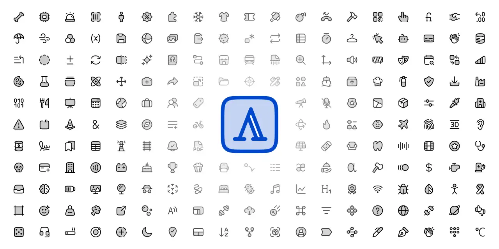

# andrsrxn/icons

[](https://www.npmjs.com/package/@andrsrxn/icons)
[](https://www.npmjs.com/package/@andrsrxn/icons)
[](https://www.npmjs.com/package/@andrsrxn/icons)
[](https://github.com/andrsrxn/icons)
[](https://github.com/andrsrxn/icons/actions/workflows/ci.yml)
[](https://github.com/andrsrxn/icons/actions/workflows/github-code-scanning/codeql)
[](https://biomejs.dev)

React icon library with 900+ duotone icons and 250+ flag icons. Fully typed, RTL-aware, and optimized SVGs.



## Overview

This library was built to serve as the icon foundation for **[@andrsrxn/ui](https://ui.andrsrxn.com)**, an upcoming open-source, opinionated Design System and Component Library aimed at enterprise-grade products.

While `@andrsrxn/icons` is tightly coupled to that vision, it is intentionally published as a **standalone package**. This keeps it lightweight, independently versioned, and freely usable by anyone (regardless of whether they adopt `@andrsrxn/ui`). Icon documentation will be available at [ui.andrsrxn.com/icons](https://ui.andrsrxn.com/icons) once the UI package is released.

### Why another icon library?

The short answer: **there are no free duotone icon sets with the right style**.

Most libraries offer only outline or solid variants. [Phosphor Icons](https://phosphoricons.com/) does include free duotone variants, but its implementation applies a duotone layer to every icon unconditionally, even purely geometric ones like arrows or plus signs that have no meaningful background shape. This results in unnecessary visual noise and icons that feel semantically inconsistent.

`@andrsrxn/icons` takes a more deliberate approach:

- **Duotone by default**: Icons that have a meaningful path/fill distinction are always duotone.
- **Outline when appropriate**: Simple geometric icons such as `+`, `/`, or `×` do not receive a decorative background layer that would only reduce clarity.
- **Filled on demand**: A `filled` variant is included only for icons that have a meaningful active or selected state, such as `like`, `bookmark`, or `star`, not as a blanket alternative style.

## Requirements

You only need to be using `react` and `react-dom` version 19.

> **Warning**: This is an ESM-only package, make sure your project is using Node `20.16.0`, `22.19.0`, `24.0.0` or higher, and has the `"type": "module"` field in your `package.json`.

## Installation

```bash
pnpm add @andrsrxn/icons
```

Then add the minimal CSS to the root of your project

```tsx
import '@andrsrxn/icons/styles.css'
```

## Categories

- **UI**: 900+ functional icons for apps, each with its own preview image. (aspect ratio 1:1)
- **Flags**: 250+ simple and minimal country flags, named with ISO 3166-1 alpha-2 code (`IconFlagUS`, `IconFlagMX`), the exceptions are `IconFlagLGTB` and continent flags, which have a `C` prefix (`IconFlagCAF` for Africa, `IconFlagCNA` for North America, and so on); treated as image assets with country code as `title` included. (aspect ratio 3:2)

## Usage

### Global import

Still tree-shakable, it will only import the icons you use.

```tsx
import { IconRocket } from '@andrsrxn/icons'
import { IconFlagUS } from '@andrsrxn/icons/flags'

export function App() {
  return (
    <div className='flex h-screen w-full items-center justify-center'>
      <IconRocket />
      <IconFlagUS />
    </div>
  )
}
```

### Specific import

Explicitly importing icons is also supported, giving you more granular control over imports.

```tsx
import { IconRocket } from '@andrsrxn/icons/rocket'
import { IconFlagUS } from '@andrsrxn/icons/flags/us'

export function App() {
  return (
    <div className='flex h-screen w-full items-center justify-center'>
      <IconRocket />
      <IconFlagUS />
    </div>
  )
}
```

## RTL support

The following UI icons automatically detect the `dir` attribute on the `html` or the closest parent element and add the `transform: scaleX(-1)` CSS property to the SVG element:

- [List of RTL aware icons](./src/styles.css)

If you want to keep them as there are regardless of direction, add `transform: scaleX(1)` to each icon on RTL direction.

## Naming

All of the categories have an `Icon` prefix to differentiate them from other components and be easily importable.

## Styling

All of the icons have a specific className to style them globally or individualy

- **UI icons**: `ui-icon`
- **Flag icons**: `ui-flag`

Or you can use the custom props as the next examples:

### Size

> **Note:** If you want to keep proportions on Flag icons, only set the `width`.

1. Size prop

```tsx
<IconRocket size={48} />

// Keep 3:2 proportions
<IconFlagUS width={48} />

// Square proportions
<IconFlagUS size={48} />
```

2. Classname

```tsx
<IconRocket className='size-6' />

// Keep 3:2 proportions
<IconFlagUS className='w-6' />

// Square proportions
<IconFlagUS className='size-6' />

// To fill the entire square
<IconFlagUS className='size-6 object-cover' />
```

### Color

By default, the UI icons have `currentColor` set as fill and stroke value.

1. Color prop

```tsx
<IconRocket color='gray' />
```

2. Classname

```tsx
<IconRocket className='text-blue-500 dark:text-red-500' />
<IconFlagUS className='text-blue-500 dark:text-red-500' />
```

### Stroke width

It is not intended to change the stroke width of the icons (default `1.5`). It could lead to inconsistent results in some cases.

if you still need to change it, add `strokeWidth` prop to each icon.

```tsx
<IconRocket strokeWidth={2} />
<IconRocket className='**:stroke-2' />
```

Or set it globally yo all icons using `stroke-width` property.

```css
.ui-icon * {
  stroke-width: 2px;
}
```

## Types

We expose scoped types for each category:

```typescript
import type { Icon, IconProps } from '@andrsrxn/icons/types'
import type { FlagIcon, FlagIconProps } from '@andrsrxn/icons/flags/types'
```

- **Icon**, **FlagIcon**: The SVG element
- **IconProps**, **FlagIconProps**: Icon component props from SVG and custom props

> **Note**: Types are named this way to avoid conficts with some Icon components names, such as `IconFlag` from UI icons.

## Contributing

We currently do not accept contributions for new icons, but we appreciate suggestions and icon requests through GitHub issues.

## Support

If this project helps you, you can support its development through:

- Credit or debit card: https://app.recurrente.com/s/andrsrxn/pagar
- PayPal: https://paypal.me/andrsrxn

## Inspiration

All of the icons were made by scratch on Figma but inspired on the following icon libraries:

- [Phosphor Icons](https://phosphoricons.com/)
- [HugeIcons](https://hugeicons.com/icons)

## Credits

The flag icons are adapted from [FlagKit](https://github.com/madebybowtie/FlagKit) by [Bowtie](https://github.com/madebybowtie), used under the MIT License (Copyright (c) 2016 Bowtie AB). Only the 3:2 rectangular flag versions were used as source material and converted into `tsx` components.

See [THIRD-PARTY-LICENSES.md](THIRD-PARTY-LICENSES.md) for the full license text.

## Next steps

- Documentation
- Figma plugin
- Consider adapting the icons to other frameworks (Svelte, Vue, Angular, etc.)

## License

All icons are free to use, personal or commercial use allowed. [MIT License](LICENSE) - Copyright 2026 Andrés Raxón (andrsrxn).
